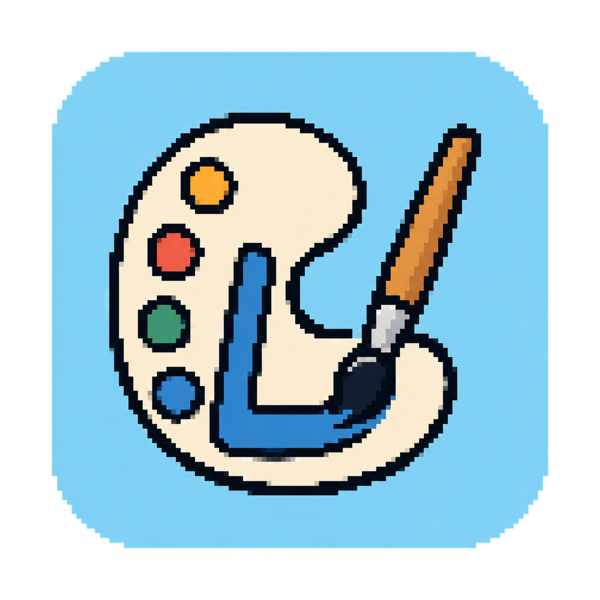
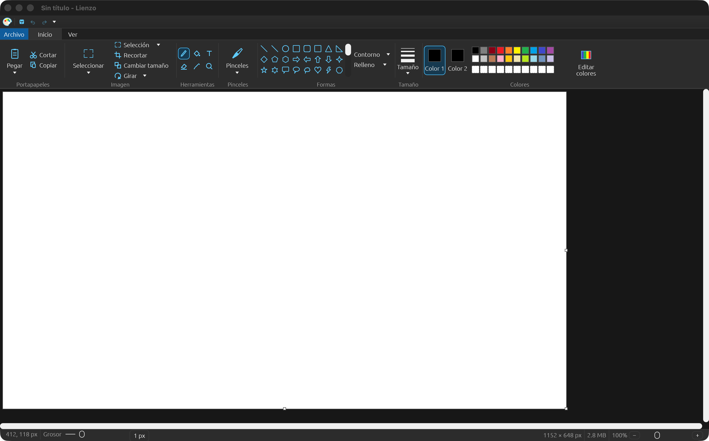
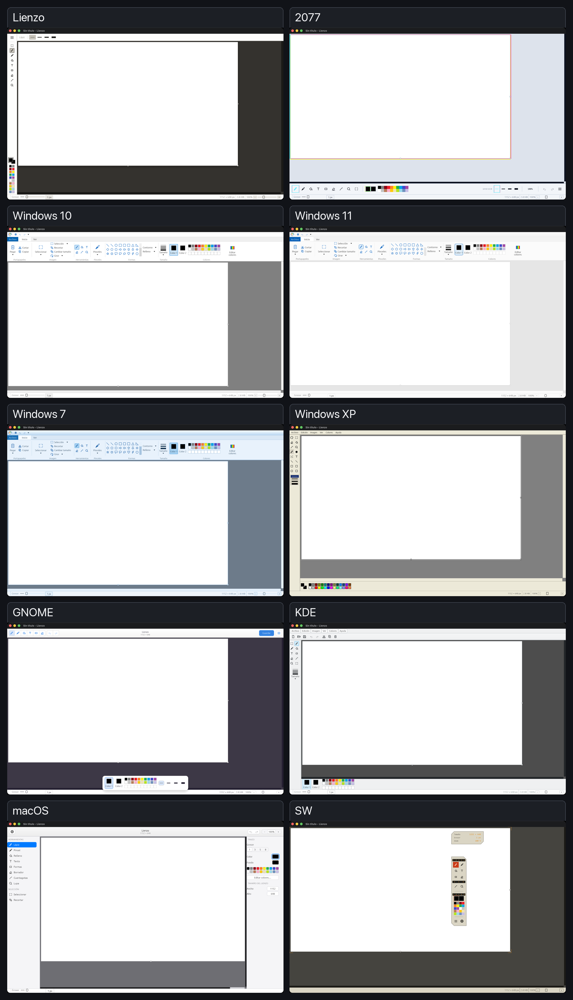
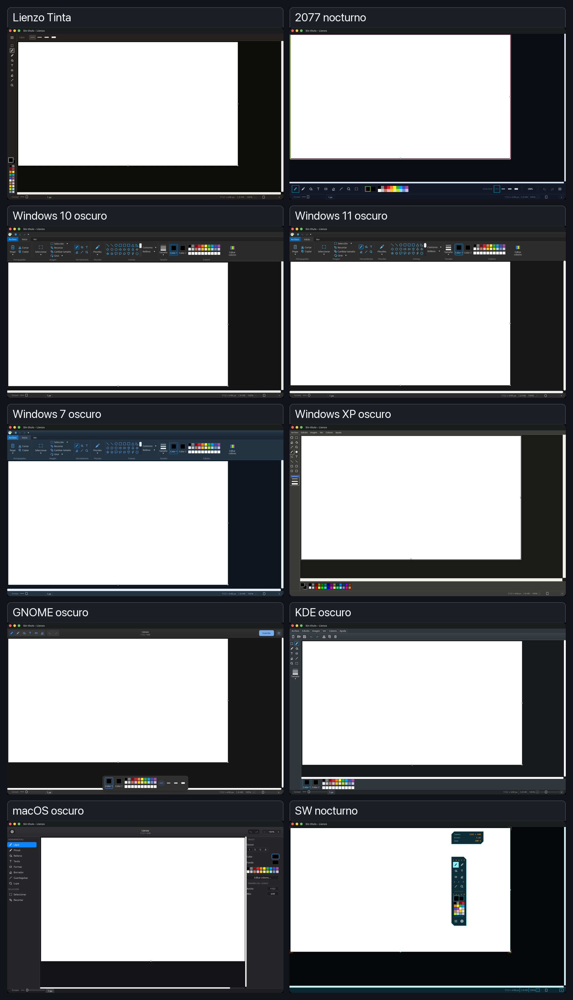
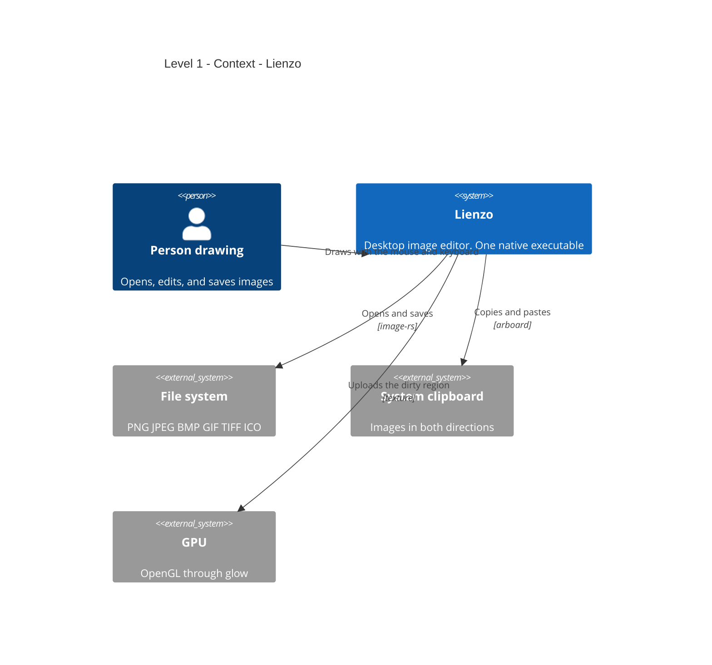
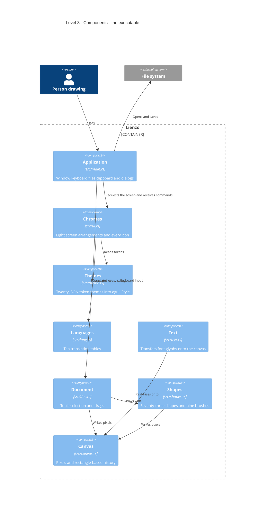

<p align="center">
  
</p>

# Lienzo

[English](README.md) · [Español](README_ES.md)

On every operating system, I have always liked having a simple tool close at
hand for working with images without turning to overly sophisticated software.
For years, that tool was Paint.

But as I moved between Windows, Linux, and macOS, I no longer felt comfortable
depending on an application tied to a single system. So I thought: why not
create my own?

That is how **Lienzo** was born: a free, fast, lightweight, and pleasant-looking
image editor inspired by Paint's simplicity, but designed to follow you across
different operating systems. I also added details, themes, and personal touches
for those of us who enjoy nostalgia: Windows XP, 7, 10, and 11, GNOME, KDE,
macOS, and three original styles. It began as a personal need, and today I am
sharing it with the community so anyone can use it, study it, and improve it.

```sh
cargo test    # the engine, without a window
cargo run     # the application
```

> **Status:** version 0.1.1 is available in portable and installable formats
> for macOS, Windows, and Linux. Printing, validation on a real Linux system,
> and completion of the web version are still pending. Full details appear
> below and in `ESTADO.md`.

---

## Requirements

| What | Version | Why |
|---|---|---|
| Rust | **1.95 or newer** | Required by egui 0.36 through its `rust-version` |
| macOS | 11 or newer, Apple Silicon | Built and tested on ARM64 |
| Windows | 10 or 11, x86_64 | Built and tested on Windows x86_64 |
| Linux | x86_64, glibc 2.35+, X11 or Wayland | Built; validation on a real distribution is still pending |

There is no database, server, or environment variable. There is nothing to
configure.

## Downloads and installation

Binaries are published on [GitHub Releases](https://github.com/poncho-ajmv/lienzo/releases).

| System | Portable | System installation |
|---|---|---|
| macOS Apple Silicon | ZIP containing `Lienzo.app` | DMG: drag Lienzo into Applications |
| Windows x86_64 | ZIP containing `Lienzo.exe` | `Setup.exe`, with shortcuts and an uninstaller |
| Linux x86_64 | AppImage | DEB package for Debian and Ubuntu |

The binaries do not yet have a commercial signature. macOS Gatekeeper and
Windows SmartScreen may display a warning the first time they are opened.

Each `vX.Y.Z` tag runs `.github/workflows/release.yml`: it validates the code,
builds on all three systems, creates every package, and publishes the release
along with its `SHA256SUMS.txt` file.

## Building from source

```sh
git clone https://github.com/poncho-ajmv/lienzo.git
cd lienzo
cargo run --release
```

The first build downloads and compiles all of egui. It takes a few minutes and
uses about 2 GB in `target/`. Later builds take only seconds.

## Usage

The application opens with a 1152 × 648 canvas and the pencil selected. Tools
are available in the top ribbon—or in a side rail or floating console,
depending on the theme—and stroke width is also available in the bottom bar.

| Shortcut | Action |
|---|---|
| `Cmd/Ctrl + N` · `O` · `S` | New · Open · Save |
| `Cmd/Ctrl + Shift + S` | Save as |
| `Cmd/Ctrl + Z` · `Y` | Undo · Redo |
| `Cmd/Ctrl + X` · `C` · `V` | Cut · Copy · Paste |
| `Cmd/Ctrl + A` | Select all |
| `Cmd/Ctrl + W` | Resize and skew |
| `Cmd/Ctrl + E` | Canvas properties |
| `Cmd/Ctrl + Shift + I` | Invert colors |
| `Cmd/Ctrl + +` · `−` · `0` | Zoom in · Zoom out · Actual size |
| `Cmd/Ctrl + wheel` | Zoom in or out over the canvas |
| `Delete` / `Backspace` | Delete the selection |
| `Esc` | Close whatever is open |

The theme, language, and colors are selected under **File → Settings** and are
saved automatically for the next session.

## Appearance and themes

Lienzo adapts both its colors and the arrangement of its tools. This is the
application on macOS using the Windows 10 theme:

[](assets/screenshots/lienzo-principal.png)

It includes **20 themes in 10 families**, each with a light and dark variant.
The gallery contains screenshots from the real application and separates both
modes so every interface can be seen clearly. Click an image to enlarge it.

### Light themes

[](assets/screenshots/temas-claros.png)

### Dark themes

[](assets/screenshots/temas-oscuros.png)

## Architecture — C4 model

### Level 1 · Context



There is no level 2. In C4, a container is a separately deployed and running
unit, and there is only **one** here: the executable. Built-in themes and
languages are embedded with `include_str!`; only custom themes are read from
`themes/` at startup. They are not containers either. Drawing a level 2 with a
single box inside would say nothing that level 1 does not already say.

### Level 3 · Components

Each box is a real file under `src/`.



**The boundary lies between `doc` and `main`.** `canvas`, `shapes`, and `doc`
do not know that egui exists: they depend only on `ecolor` for the color type.
That is why the 27 tests run without a window, GPU, or event loop. Everything
that touches egui lives on the other side.

## Decisions worth explaining

**History stores rectangles, not canvases.** A complete snapshot of a
1152 × 648 canvas weighs 2.9 MB; fifty snapshots weigh 145 MB, before opening
anything larger. Lienzo copies the canvas once into a reusable buffer when a
stroke begins and keeps **only the region touched by the stroke**—about 50 KB
for a normal pencil stroke, 56 times less. The budget is measured in bytes
rather than steps, so small strokes buy thousands of undo levels while
whole-canvas operations degrade gradually.

**The same rectangle drives the GPU.** Only the dirty region is uploaded to the
texture. This is not merely an optimization but a requirement: a complete
upload allocates a new texture on every call.

**The interface does not depend on images.** Each shape draws its gallery icon
with the same list of points used to draw on the canvas, while tool icons are
vector strokes that use the theme's color. Only the native application icon
uses the official image and is exported as ICNS, ICO, or PNG depending on the
system.

**Themes are data; arrangements are code.** A theme selects one of eight
*chromes*, and a chrome is a Rust function. egui does not support data-driven
layouts ([issue #4378](https://github.com/emilk/egui/issues/4378)), so you can
write a Windows 2000 theme by reusing the XP chrome, but you cannot invent a
new arrangement from a file.

## Project structure

```
src/            the eight modules shown in the diagram above
assets/         official logo and public screenshots
themes/         twenty themes in ten families, one light and one dark each
lang/           ten language tables. es.json is intentionally empty
mockups/        HTML sketches used to validate each redesign
packaging/      metadata and native installer icons
ESTADO.md       log of what was reviewed, fixed, and remains pending
target/         not included in the repository. Created by Cargo
dist/           local release artifacts; ignored by Git
```

## Themes

A theme is JSON containing about thirty named tokens. Anything omitted is
inherited from the built-in Windows 10 theme, so a working theme can be three
lines long:

```json
{ "name": "My theme", "chrome": "palette", "accent": "#ff0000" }
```

The eight chromes:

| Chrome | Used by |
|---|---|
| `ribbon` | Windows 7, 10, and 11 |
| `palette` | Windows XP |
| `mac` | macOS |
| `gnome` · `kde` | Linux |
| `studio` | Lienzo |
| `neon` | 2077 |
| `holo` | SW |

Each theme declares its opposite-mode counterpart in the `pair` field. When
switching between light and dark mode, Lienzo moves to the matching variant in
the same family instead of the adjacent theme. A test verifies that the pair
works in both directions.

To add a built-in theme, place its JSON file in `themes/`, add its line to
`BUILTIN` in `src/theme.rs`, and rebuild. You can also leave an additional JSON
file under `themes/`; it is loaded at startup without rebuilding as long as its
name does not duplicate an embedded theme.

## Languages

Ten languages are included: Spanish, English, Portuguese, French, German,
Italian, Russian, Polish, Turkish, and Dutch. These are the languages that the
font bundled with egui can draw; Chinese or Hindi would appear as empty boxes.

Translation keys are **the Spanish source strings**, so anything not yet
translated falls back to the original instead of displaying a technical key.
The seventy-three shape names still use that fallback.

## Verifying that it works

```sh
cargo test
```

The tests cover the engine: undo must be exact, fill must respect boundaries,
no shape may leave its box or cross itself, stretching a selection and
returning it to its previous size must reproduce the previous image, every
theme must parse, and no translation may be blank.

## Project status

**Working**

The nine tools, nine brushes, seventy-three shapes, undo and redo, rectangular
and free-form selection with eight resize handles, text with real fonts,
opening and saving six formats, two-way clipboard, twenty themes, ten
languages, and persistence across sessions.

**Pending**

| What | Current state |
|---|---|
| Printing and print preview | Only display a status-bar message |
| Web (WASM) | Builds, but open, save, and paste are unavailable |
| Packaging | Portable and installer ready for all three platforms; no commercial signature |
| Free-form selection | Crops correctly, but its outline is the containing rectangle |
| Windows and Linux | Build for x86_64; testing on real systems remains pending |

## License

MIT — poncho-ajmv.
