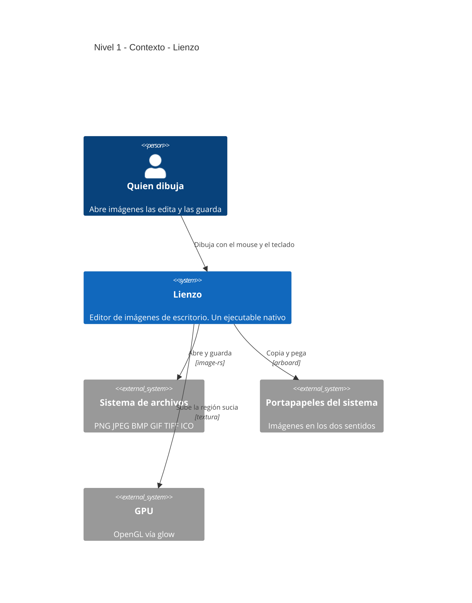
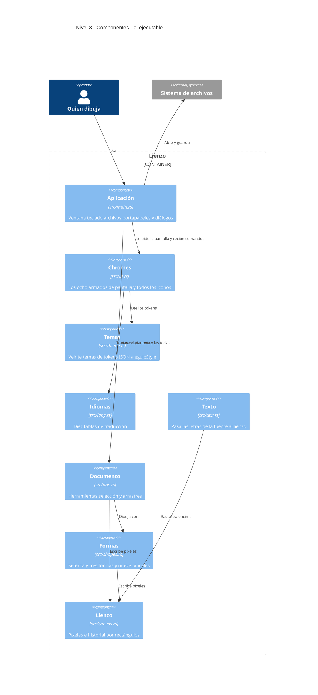

# Lienzo

Un clon de Paint de Windows, escrito en Rust desde cero. Un solo ejecutable, sin
runtime, sin navegador empaquetado y sin recolector de basura entre vos y los
píxeles.

Fiel al Paint de Windows 10 que te acordás —la cinta, el borrador selectivo con
clic derecho, la selección transparente, el bote de relleno sin tolerancia— con
una diferencia: **se cambia la piel**. Veinte temas en diez familias, entre ellas
Windows XP, 7, 10 y 11, GNOME, KDE, macOS y tres propias.

```sh
cargo test    # el motor, sin ventana
cargo run     # la aplicación
```

> **Estado:** el motor está probado y la aplicación corre. Falta imprimir,
> empaquetar para las tres plataformas y terminar la versión web. El detalle
> completo está más abajo y en `ESTADO.md`.

---

## Requisitos

| Qué | Versión | Por qué |
|---|---|---|
| Rust | **1.95 o superior** | Es lo que pide egui 0.36 en su `rust-version` |
| macOS | Cualquiera con Metal | Probado acá |
| Windows | 10 u 11 | Sin probar todavía |
| Linux | X11 o Wayland | Sin probar. Hacen falta las cabeceras de X11 y Wayland, y `xdg-desktop-portal` para los diálogos de archivo |

No hay base de datos, ni servidor, ni variables de entorno. Nada que configurar.

## Instalación desde cero

```sh
git clone https://github.com/poncho-ajmv/lienzo.git
cd lienzo
cargo run --release
```

La primera compilación baja y compila egui entero: tarda unos minutos y ocupa
~2 GB en `target/`. Las siguientes son de segundos.

## Uso

La aplicación abre con un lienzo de 1152 × 648 y el lápiz en la mano. Las
herramientas están en la cinta de arriba —o en el riel lateral, o en la consola
flotante, según el tema— y el grosor también en la barra de abajo.

| Atajo | Qué hace |
|---|---|
| `Cmd/Ctrl + N` · `O` · `S` | Nuevo · Abrir · Guardar |
| `Cmd/Ctrl + Shift + S` | Guardar como |
| `Cmd/Ctrl + Z` · `Y` | Deshacer · Rehacer |
| `Cmd/Ctrl + X` · `C` · `V` | Cortar · Copiar · Pegar |
| `Cmd/Ctrl + A` | Seleccionar todo |
| `Cmd/Ctrl + W` | Cambiar tamaño y sesgar |
| `Cmd/Ctrl + E` | Propiedades del lienzo |
| `Cmd/Ctrl + Shift + I` | Invertir colores |
| `Cmd/Ctrl + +` · `−` · `0` | Acercar · Alejar · Tamaño real |
| `Supr` / `Retroceso` | Borrar la selección |
| `Esc` | Cerrar lo que esté abierto |

El tema, el idioma y los colores se eligen en **Archivo → Configuración** y se
guardan solos para la próxima vez.

## Arquitectura — modelo C4

### Nivel 1 · Contexto



No hay nivel 2. Un contenedor en C4 es una pieza que se despliega y ejecuta por
separado, y acá hay **una sola**: el ejecutable. Los temas y los idiomas no son
archivos que se leen al arrancar sino texto embebido en el binario con
`include_str!`, así que tampoco son contenedores. Dibujar un nivel 2 con una
caja adentro no diría nada que no diga el nivel 1.

### Nivel 3 · Componentes

Cada caja es un archivo real de `src/`.



**La frontera está entre `doc` y `main`.** `canvas`, `shapes` y `doc` no saben
que egui existe: dependen sólo de `ecolor` para el tipo de color. Por eso los 23
tests corren sin ventana, sin GPU y sin bucle de eventos. Todo lo que toque egui
vive del otro lado.

## Decisiones que valen la pena contar

**El historial guarda rectángulos, no lienzos.** Una foto completa de un lienzo
de 1152 × 648 pesa 2,9 MB; cincuenta son 145 MB, y eso antes de abrir nada
grande. Lienzo copia el lienzo una vez a un buffer reutilizado al empezar el
trazo y se queda **sólo con la región que el trazo tocó** — unos 50 KB para un
trazo normal de lápiz, 56 veces menos. El presupuesto se mide en bytes y no en
pasos, así que los trazos chicos compran miles de niveles de deshacer y las
operaciones de lienzo entero se degradan de a poco.

**El mismo rectángulo maneja la GPU.** Sólo la región sucia se sube a la
textura. No es una optimización sino un requisito: una subida completa asigna
una textura nueva en cada llamada.

**No hay un solo archivo de icono.** Cada forma dibuja su icono de la galería
con la misma lista de puntos con la que dibuja en el lienzo, y los iconos de
herramienta son trazos vectoriales que toman el color del tema. Nada que
exportar, nada borroso en pantallas HiDPI.

**Los temas son datos, los armados son código.** Un tema elige entre ocho
*chromes*, y un chrome es una función de Rust. egui no tiene layout por datos
([issue #4378](https://github.com/emilk/egui/issues/4378)), así que podés
escribir un tema de Windows 2000 reusando el chrome de XP, pero no podés
inventar un armado nuevo desde un archivo.

## Estructura del proyecto

```
src/            los ocho módulos del diagrama de arriba
themes/         veinte temas en diez familias, uno claro y uno oscuro cada una
lang/           diez tablas de idioma. es.json va vacío a propósito
mockups/        los bocetos HTML con los que se validó cada rediseño
ESTADO.md       la bitácora: qué se revisó, qué se corrigió, qué falta
target/         no viene en el repo. Lo crea cargo
```

## Temas

Un tema es un JSON con unos treinta tokens con nombre. Lo que dejes afuera lo
hereda del Windows 10 de fábrica, así que uno que funcione puede tener tres
líneas:

```json
{ "name": "Mi tema", "chrome": "palette", "accent": "#ff0000" }
```

Los ocho chromes:

| Chrome | Lo usan |
|---|---|
| `ribbon` | Windows 7, 10 y 11 |
| `palette` | Windows XP |
| `mac` | macOS |
| `gnome` · `kde` | Linux |
| `studio` | Lienzo |
| `neon` | 2077 |
| `holo` | SW |

Cada tema declara su pareja del modo contrario en el campo `pair`: al cambiar
entre claro y oscuro, Lienzo salta a la variante de la misma familia en vez de
al tema de al lado. Un test verifica que la pareja sea de ida y de vuelta.

Para agregar uno: poné el JSON en `themes/`, sumá la línea en `BUILTIN` de
`src/theme.rs` y recompilá. **No se leen del disco al arrancar** — van
embebidos, que es lo que hace que el ejecutable sea uno solo.

## Idiomas

Diez: español, inglés, portugués, francés, alemán, italiano, ruso, polaco,
turco y neerlandés. Son los que la fuente que trae egui puede dibujar; con chino
o hindi saldrían cuadraditos vacíos.

Las claves son **la cadena en español**, así que lo que falte por traducir cae
al original en vez de mostrar una clave técnica. Los setenta y tres nombres de
forma todavía caen así.

## Comprobar que funciona

```sh
cargo test
```

Cubren el motor: que deshacer sea exacto, que el relleno respete los bordes, que
ninguna forma se salga de su caja ni se cruce a sí misma, que estirar una
selección y devolverla al tamaño de antes dé la imagen de antes, que todos los
temas parseen y que ninguna traducción quede en blanco.

## Estado del proyecto

**Funciona**

Las nueve herramientas, los nueve pinceles, las setenta y tres formas, deshacer
y rehacer, selección rectangular y libre con estirado por las ocho manijas,
texto con fuentes de verdad, abrir y guardar en seis formatos, portapapeles en
los dos sentidos, veinte temas, diez idiomas, y todo eso guardado entre
sesiones.

**Falta**

| Qué | Cómo está |
|---|---|
| Imprimir y vista previa | Sólo dejan un mensaje en la barra de estado |
| Web (WASM) | Compila, pero abrir, guardar y pegar no están |
| Empaquetado | Sin hacer. Notarizar en macOS cuesta 99 USD al año |
| Selección libre | Recorta bien, pero el marco que dibuja es el rectángulo que la contiene |
| Windows y Linux | Sin probar |

## Licencia

MIT — poncho-ajmv.
